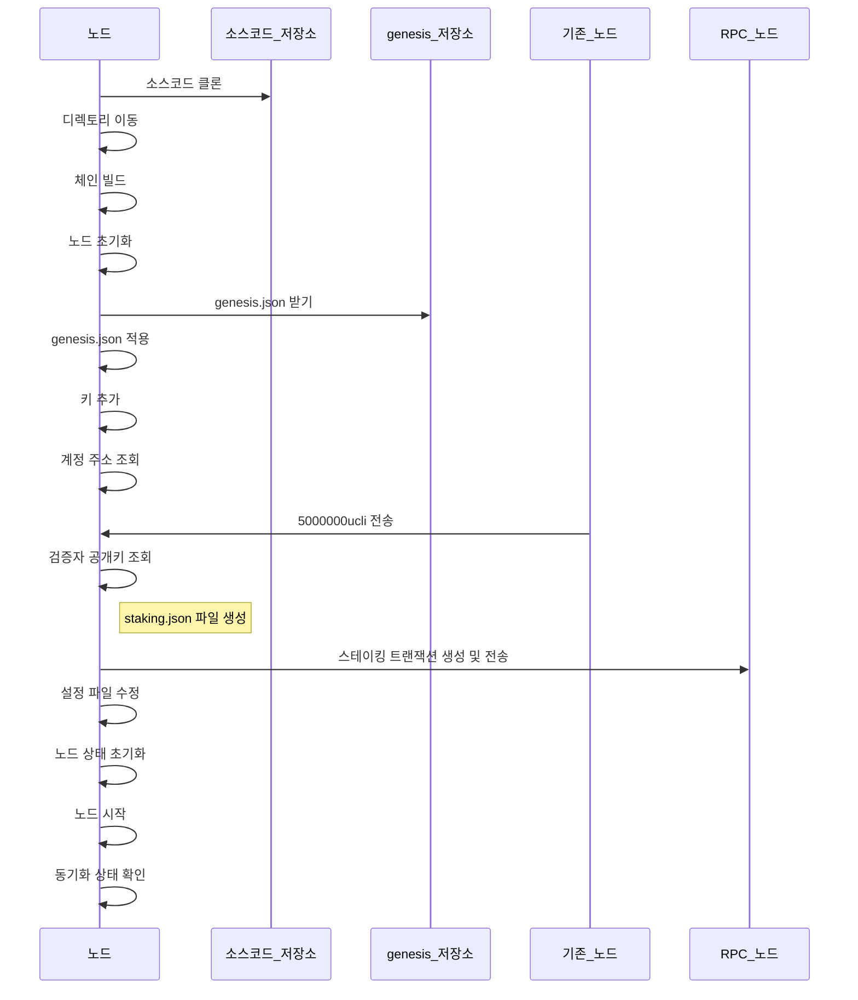

# 새로운 밸리데이터를 추가하는 방법

## Install Go

```shell
wget go1.22.3.linux-amd64.tar.gz
tar -C /usr/local -xzf go1.22.3.linux-amd64.tar.gz
```

```shell
vi .profile
```

```
PATH=$PATH:/usr/local/go/bin
PATH=$PATH:$HOME/go/bin
```

## Install Ignite

```shell
curl https://get.ignite.com/cli! | bash
```

--

## Set Up a Validator

### 전체 과정 요약

1. 소스코드 다운로드 및 빌드 (`git clone <repository_url>` -> `cd <repository_directory>` -> `ignite chain build`)
2. 노드 초기화 및 `genesis.json` 적용 (`uclid init validator-3 --chain-id uclid-devnet` -> `curl -O <genesis_file_url> -o ~/.ucli/config/genesis.json`)
3. 키 추가 및 계정 주소 조회 (`uclid keys add validator-3 --keyring-backend file` -> `uclid keys show validator-3 --keyring-backend file -a`)
4. 코인 구매 및 계정에 전송 (코인을 구매하여 전송하거나 기존 밸리데이터 노드에서 전송, `--fees 2000ucli` 추가)
5. 스테이킹 트랜잭션 생성 및 전송
   - `uclid comet show-validator`를 사용하여 `pubkey` 값을 조회
   - `staking.json` 파일 생성
   - `uclid tx staking create-validator ./staking.json --from=validator-3 --keyring-backend=file --chain-id=uclid-devnet --node tcp://<your.other.nodes.ipaddress>:26657 --fees 2000ucli`
6. 설정 파일 수정 (`app.toml` 및 `config.toml` 수정)
7. 노드 상태 초기화 (`uclid comet unsafe-reset-all`)
8. 노드 실행 및 동기화 (`uclid start`)
9. 동기화 상태 확인 (REST API 사용)
10. 노드 실행 및 모니터링 (`uclid start`)



#### 1. 소스코드 다운로드 및 빌드

새로운 노드에서 소스코드를 다운로드하고 빌드합니다.

```sh
git clone <repository_url>
cd <repository_directory>
ignite chain build
```

#### 2. 노드 초기화 및 `genesis.json` 적용

새로운 노드에서 초기화하고 `genesis.json` 파일을 받아 적용합니다.

```sh
uclid init validator-3 --chain-id uclid-devnet
curl -O <genesis_file_url> -o ~/.ucli/config/genesis.json
```

#### 3. 키 추가 및 계정 주소 조회

키를 추가하고 생성한 계정의 주소를 조회합니다.

```sh
uclid keys add validator-3 --keyring-backend file
uclid keys show validator-3 --keyring-backend file -a
```

#### 4. 코인 구매 및 계정에 전송

코인을 구매하여 전송하거나 기존 밸리데이터 노드에서 새로운 노드의 계정으로 코인을 전송합니다.

```sh
uclid tx bank send validator-1 <validator-3_address> 5000000000000ucli --chain-id uclid-devnet --keyring-backend file --fees 2000ucli
```

#### 5. 스테이킹 트랜잭션 생성 및 전송

`pubkey` 값을 조회하고, `staking.json` 파일을 생성합니다.

**새로운 노드:**

`pubkey` 값을 조회합니다:

```sh
uclid comet show-validator
```

`./staking.json` 파일을 생성합니다:

```json
{
  "pubkey": {
    "@type": "/cosmos.crypto.ed25519.PubKey",
    "key": "<pubkey_value>"
  },
  "amount": "4000000000000ucli",
  "moniker": "validator-3",
  "identity": "",
  "website": "",
  "security": "",
  "details": "",
  "commission-rate": "0.1",
  "commission-max-rate": "0.2",
  "commission-max-change-rate": "0.01",
  "min-self-delegation": "1"
}
```

`staking.json` 파일을 생성한 후, 트랜잭션을 생성하고 다른 노드의 RPC로 전송합니다.

```sh
uclid tx staking create-validator ./staking.json --from=validator-3 --keyring-backend=file --chain-id=uclid-devnet --node tcp://<your.other.nodes.ipaddress>:26657 --fees 2000ucli
```

#### 6. 설정 파일 수정

**새로운 노드의 `app.toml` 파일 (`~/.ucli/config/app.toml`):**

```toml
minimum-gas-prices = "0.01ucli"
```

**새로운 노드의 `config.toml` 파일 (`~/.ucli/config/config.toml`):**

```toml
[rpc]
laddr = "tcp://0.0.0.0:26657"

[p2p]
persistent_peers = "<node1_id>@<first_node_ip>:26656,<node2_id>@<second_node_ip>:26656"
```

#### 7. 노드 상태 초기화

노드 상태를 초기화합니다.

```sh
uclid comet unsafe-reset-all
```

#### 8. 노드 실행 및 동기화

이제 노드를 다시 시작하여 동기화합니다.

```sh
uclid start
```

#### 9. 동기화 상태 확인

노드가 기존 네트워크와 동기화가 완료될 때까지 기다립니다. 동기화 상태를 확인하려면 REST API를 사용할 수 있습니다.

```sh
curl http://localhost:26657/status
```

#### 10. 노드 실행 및 모니터링

노드가 네트워크에 정상적으로 참여하고 있는지 확인합니다. 블록이 정상적으로 생성되고 있는지, 트랜잭션이 정상적으로 처리되는지 모니터링합니다.
