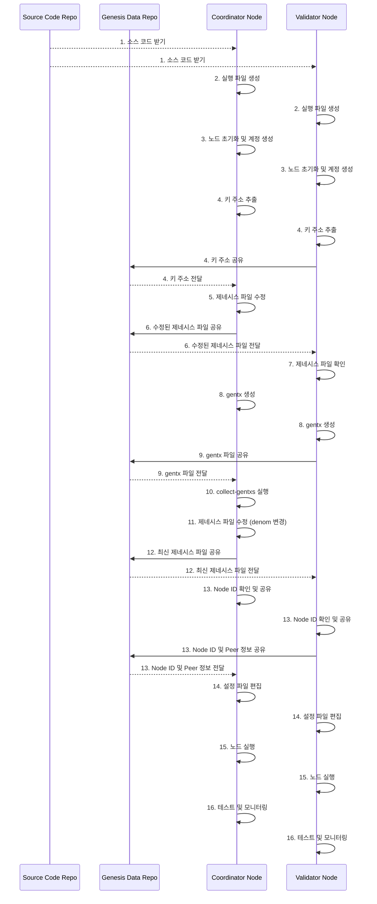

# 제네시스 단계의 작업

## Install Go

```shell
wget go1.22.3.linux-amd64.tar.gz
tar -C /usr/local -xzf go1.22.3.linux-amd64.tar.gz
```

```shell
vi .profile
```

```
PATH=$PATH:/usr/local/go/bin
PATH=$PATH:$HOME/go/bin
```

## Install Ignite

```shell
curl https://get.ignite.com/cli! | bash
```

--

## Set Up Genesis

### 전체 과정 요약

1. 소스 코드 받기 (`git clone <source-code-repo-url>`)
2. 실행 파일 생성 (`ignite chain build`)
3. 노드 초기화 (`uclid init <moniker> --chain-id uclid-devnet`)
4. 키 추가 (`uclid keys add <validator_name> --keyring-backend file`)
5. 각 노드의 키 주소 추출 및 공유
   - Validator Node에서 키 주소를 제네시스 저장소를 통해 Coordinator Node에게 전달
6. 제네시스 파일 수정 (`uclid genesis add-genesis-account <validator_address> 20000000000000ucli --keyring-backend file`)
7. 수정된 제네시스 파일 공유 (제네시스 저장소를 통해 `genesis.json` 공유)
8. 제네시스 파일 확인 (`cat ~/.ucli/config/genesis.json`)
9. `gentx` 생성 (`uclid genesis gentx <validator_name> 100000000ucli --chain-id uclid-devnet --keyring-backend file`)
10. `gentx` 파일 공유 (Validator Node에서 제네시스 저장소를 통해 `gentx` 파일 공유)
11. `collect-gentxs` 실행 (`uclid genesis collect-gentxs --keyring-backend file`)
12. 제네시스 파일 수정 (denom 변경, `sed -i 's/"stake"/"ucli"/g' ~/.ucli/config/genesis.json`)
13. Node ID 및 Peer 정보 확인 및 공유 (제네시스 저장소를 통해 Node ID와 Peer 정보 공유)
14. 설정 파일 편집 (`persistent_peers` 및 `minimum-gas-prices` 설정)
    - Coordinator Node의 RPC 설정 변경 (`laddr = "tcp://0.0.0.0:26657"`)
15. 노드 실행 (`uclid start`)
16. 테스트 및 모니터링



#### 1. 소스 코드 받기

먼저, 소스 코드가 있는 Git 저장소에서 코드를 클론합니다.

```sh
git clone <source-code-repo-url>
cd <source-code-repo-directory>
```

#### 2. 실행 파일 생성

`ignite`를 사용하여 실행 파일을 만듭니다.

```sh
ignite chain build
```

#### 3. 노드 초기화 및 계정 생성

각 노드에서 초기화하고 키를 생성합니다.

**Coordinator Node:**

```sh
uclid init coordinator-node --chain-id uclid-devnet
uclid keys add coordinator-node --keyring-backend file
```

**Validator Node:**

```sh
uclid init validator-node --chain-id uclid-devnet
uclid keys add validator-node --keyring-backend file
```

#### 4. 키 주소 추출 및 공유

각 노드에서 생성된 키의 주소를 추출합니다.

**Coordinator Node:**

```sh
uclid keys show coordinator-node -a --keyring-backend file
```

**Validator Node:**

```sh
uclid keys show validator-node -a --keyring-backend file
```

각 노드의 주소를 기록해 둡니다. 예를 들어:

- coordinator-node: mage1...
- validator-node: mage1...

Validator Node는 키 주소를 제네시스 관련 데이터를 공유하는 Git 저장소를 통해 Coordinator Node에게 전달합니다.

**Validator Node:**

1. 키 주소를 제네시스 저장소에 추가하고 커밋합니다.

```sh
cd <genesis-repo-root>
echo "<validator-node_address>" > validator-node-address.txt
git add validator-node-address.txt
git commit -m "Add validator-node address"
git push origin main
```

2. Coordinator Node에서 제네시스 저장소에서 변경 사항을 풀합니다.

**Coordinator Node:**

```sh
cd <genesis-repo-root>
git pull origin main
validator_node_address=$(cat validator-node-address.txt)
```

#### 5. 제네시스 파일 수정

Coordinator Node에서 제네시스 파일을 수정하여 두 노드의 초기 잔액을 할당합니다.

**Coordinator Node:**

```sh
uclid genesis add-genesis-account coordinator-node 20000000000000ucli --keyring-backend file
uclid genesis add-genesis-account $validator_node_address 20000000000000ucli --keyring-backend file
```

#### 6. 수정된 제네시스 파일 공유

수정된 제네시스 파일을 제네시스 저장소를 통해 공유합니다.

**Coordinator Node:**

1. 수정된 `genesis.json` 파일을 제네시스 저장소에 추가하고 커밋합니다.

```sh
cd <genesis-repo-root>
cp ~/.uclid/config/genesis.json ./genesis.json
git add genesis.json
git commit -m "Add modified genesis.json"
git push origin main
```

2. Validator Node에서 제네시스 저장소에서 변경 사항을 풀합니다.

**Validator Node:**

```sh
cd <genesis-repo-root>
git pull origin main
cp ./genesis.json ~/.ucli/config/genesis.json
```

#### 7. 제네시스 파일 확인

Validator Node에서 제네시스 파일이 제대로 수정되었는지 확인합니다.

**Validator Node:**

```sh
cat ~/.ucli/config/genesis.json
```

`genesis.json` 파일에서 `accounts` 섹션을 확인하여 두 계정이 올바르게 추가되었는지 확인합니다.

#### 8. `gentx` 생성

각 노드에서 `gentx`를 생성합니다.

**Coordinator Node:**

```sh
uclid genesis gentx coordinator-node 10000000000000ucli --chain-id uclid-devnet --keyring-backend file
```

**Validator Node:**

```sh
uclid genesis gentx validator-node 10000000000000ucli --chain-id uclid-devnet --keyring-backend file
```

#### 9. `gentx` 파일 공유

Validator Node에서 생성된 `gentx` 파일을 제네시스 저장소를 통해 공유합니다.

**Validator Node에서 제네시스 저장소에 `gentx` 파일을 추가하고 커밋합니다:**

```sh
cd <genesis-repo-root>
cp ~/.ucli/config/gentx/gentx-*.json ./gentx-validator-node.json
git add gentx-validator-node.json
git commit -m "Add gentx for validator-node"
git push origin main
```

Coordinator Node는 Validator Node의 `gentx` 파일을 가져옵니다:

**Coordinator Node:**

```sh
cd <genesis-repo-root>
git pull origin main
cp ./gentx-validator-node.json ~/.uclid/config/gentx/
```

#### 10. `collect-gentxs` 실행

Coordinator Node에서 `gentx` 파일을 모아서 `collect-gentxs`를 실행합니다.

**Coordinator Node:**

```sh
uclid genesis collect-gentxs
```

이 명령어는 `gentx` 파일을 모아서 제네시스 파일을 업데이트합니다.

#### 11. 제네시스 파일 수정 (denom 변경)

`collect-gentxs` 후에 `genesis.json` 파일에서 모든 `stake` denom을 `ucli`로 변경합니다.

**Coordinator Node:**

```sh
sed -i 's/"stake"/"ucli"/g' ~/.uclid/config/genesis.json
```

#### 12. 최신 제네시스 파일 공유

업데이트된 제네시스 파일을 제네시스 저장소를 통해 모든 노드에 공유합니다.

**Coordinator Node:**

1. 수정된 `genesis.json` 파일을 제네시스 저장소에 추가하고 커밋합니다.

```sh
cd <genesis-repo-root>
cp ~/.uclid/config/genesis.json ./genesis.json
git add genesis.json
git commit -m "Update genesis.json with new validators"
git push origin main
```

2. 모든 노드에서 제네시스 저장소에서 변경 사항을 풀합니다.

**모든 노드:**

```sh
cd <genesis-repo-root>
git pull origin main
cp ./genesis.json ~/.uclid/config/genesis.json
```

#### 13. Node ID 및 Peer 정보 확인 및 공유

각 노드의 Node ID를 확인하고 IP 주소 및 포트를 함께 제네시스 저장소를 통해 공유합니다.

**Coordinator Node:**

```sh
node1_id=$(uclid comet show-node-id)
node1_info="$node1_id@<coordinator_node_ip>:26656"
echo $node1_info > node1-info.txt
git add node1-info.txt
git commit -m "Add Node ID and peer info for coordinator-node"
git push origin main
```

**Validator Node:**

```sh
node2_id=$(uclid comet show-node-id)
node2_info="$node2_id@<validator_node_ip>:26656"
echo $node2_info > node2-info.txt
git add node2-info.txt
git commit -m "Add Node ID and peer info for validator-node"
git push origin main
```

각 노드는 상대 노드의 Node ID와 Peer 정보를 가져옵니다:

**Coordinator Node:**

```sh
cd <genesis-repo-root>
git pull origin main
node2_info=$(cat node2-info.txt)
```

**Validator Node:**

```sh
cd <genesis-repo-root>
git pull origin main
node1_info=$(cat node1-info.txt)
```

#### 14. 설정 파일 편집

각 노드의 설정 파일을 편집합니다 (`~/.uclid/config/config.toml` 및 `~/.uclid/config/app.toml`).

##### Coordinator Node의 RPC 설정 변경

Coordinator Node에서 RPC가 외부에서 접속할 수 있도록 `config.toml` 파일을 수정합니다.

**Coordinator Node의 설정 파일 (`~/.uclid/config/config.toml`):**

```toml
[rpc]
laddr = "tcp://0.0.0.0:26657"
```

##### Persistent Peers 설정

각 노드가 서로 연결될 수 있도록 `persistent_peers`를 설정합니다.

**Coordinator Node의 설정 파일 (`~/.uclid/config/config.toml`):**

```toml
persistent_peers = "$node2_info"
```

**Validator Node의 설정 파일 (`~/.uclid/config/config.toml`):**

```toml
persistent_peers = "$node1_info"
```

##### 최소 가스 가격 설정

`app.toml` 파일에서 최소 가스 가격을 설정합니다.

**각 노드의 `app.toml` 파일 (`~/.uclid/config/app.toml`):**

```toml
minimum-gas-prices = "0.01ucli"
```

#### 15. 노드 실행

모든 노드에서 다음 명령어를 실행하여 노드를 시작합니다.

```sh
uclid start
```

#### 16. 테스트 및 모니터링

네트워크가 정상적으로 동작하는지 확인합니다. 블록이 정상적으로 생성되고 있는지, 트랜잭션이 정상적으로 처리되는지 모니터링합니다.
